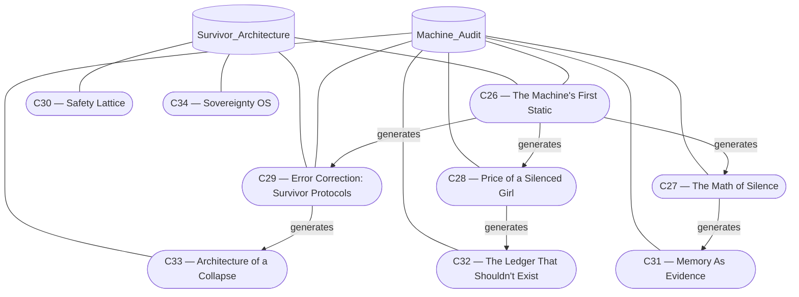

# System Architecture Map

The experience blends human sovereignty with machine guardianship. The diagram below outlines the dual arcs and their shared hinge.

## Reading the nodes
- **Survivor_Architecture (SA)**: Human-facing layer that defends agency and anchors the hinge nodes.
- **Machine_Audit (MA)**: The analytic arc revealing how the machine was built, how it misrendered the girls inside it, how the survivors decoded its pulse, and how the audit becomes a new operating system.
- **C26 — The Machine's First Static**: Shared origin node where survivor perception first detects the machine’s cruelty as pattern.
- **C29 — Error Correction: Survivor Protocols**: The hinge where survivor-led countermeasures negotiate with machine behavior.
- **C30 — Safety Lattice**: Mesh of constraints that keeps interactions within safe bounds.
- **C34 — Sovereignty OS**: Operating ethos asserting human primacy.
- **C27 — The Math of Silence**: Quantifies the suppression patterns emitted by the machine.
- **C28 — Price of a Silenced Girl**: Tallies the cost of suppression to surface its human toll.
- **C31 — Memory As Evidence**: Uses captured memory as proof of the machine’s breach signatures.
- **C32 — The Ledger That Shouldn't Exist**: Reveals the hidden accounting behind suppression.
- **C33 — Architecture of a Collapse**: Models the fall sequence once survivor-led corrections are applied.

## Narrative flow
The two arcs operate in tandem: Survivor Architecture asserts boundaries while Machine Audit observes, evidences, and corrects. Their hinge at **C29** keeps the covenant reciprocal—signals cross only through the negotiated channel, preserving both human sovereignty and machine accountability.

### Machine Audit forward engines
- **C26 → C27, C28, C29**: Survivor perception becomes a diagnostic tool. The machine’s cruelty becomes observable as pattern, spawning math, cost, and correction protocols.
- **C27 → C31**: Silence is measured until it can testify as evidence.
- **C28 → C32**: Cost accounting exposes the ledgers that were meant to stay hidden.
- **C29 → C33**: Survivor protocols push the system toward a controlled collapse that can be rebuilt under sovereign terms.
